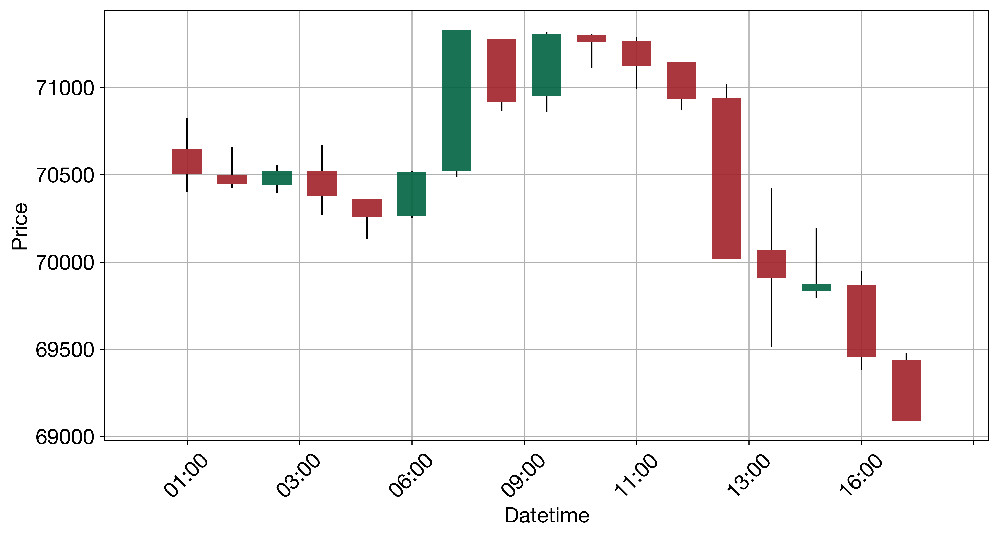
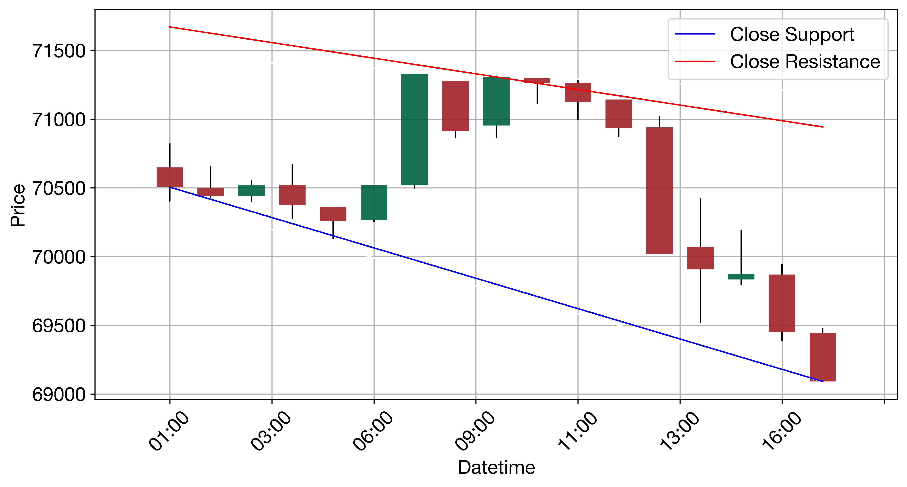

# QuantAgent — BTC-USD Crypto Experiment

## Overview

This experiment explores **QuantAgent**, a multi-agent LLM system for high-frequency trading analysis, applied to **BTC-USD** on a **1-hour timeframe** using real market data from Yahoo Finance.

The system was set up locally on macOS using the [firedintern/QuantAgent](https://github.com/firedintern/QuantAgent) fork.

---

## What Was Done

### Environment Setup
- Cloned the fork and installed all dependencies using **Python 3.11** (via Homebrew)
- Resolved the common **TA-Lib** installation issue by first installing the C library via `brew install ta-lib`, then the Python bindings via pip
- Created an isolated virtual environment (`.venv`) to avoid conflicts with the system Python (3.14)
- Configured **Anthropic Claude** as the LLM provider (instead of the default OpenAI)

### Analysis Run
- Launched the Flask web interface (`python web_interface.py`)
- Loaded **BTC-USD** OHLC data for **2026-03-24** at **1-hour** candles (~17 candles)
- The multi-agent pipeline ran the following agents in sequence:

| Agent | Role |
|---|---|
| **Indicator Agent** | Computed RSI, MACD, Stochastic Oscillator and other momentum indicators |
| **Pattern Agent** | Identified visual candlestick and chart patterns from a rendered chart image |
| **Trend Agent** | Fitted trend channels (upper/lower boundaries) and assessed market direction |
| **Decision Agent** | Synthesized all agent outputs into a final trade recommendation (LONG/SHORT, entry, stop-loss) |

---

## Charts Generated

### K-Line Chart (OHLC + Indicators)

### Trend Channel Chart

---

## Market Data Summary (BTC-USD, 2026-03-24, 1H)

| Time (UTC) | Open | High | Low | Close |
|---|---|---|---|---|
| 01:00 | 70,648 | 70,823 | 70,400 | 70,505 |
| 07:00 | 70,518 | 71,331 | 70,489 | 71,331 |
| 13:00 | 70,940 | 71,020 | 70,017 | 70,017 |
| 17:00 | 69,441 | 69,479 | 69,091 | 69,091 |

BTC moved from ~$70,600 at open to ~$69,100 by end of session — a bearish day with a peak at ~$71,331 around 07:00 UTC.

---

## Key Takeaways

- QuantAgent supports **Claude (Anthropic)** natively via `langchain-anthropic` — no OpenAI key required
- The system requires a **vision-capable LLM** since agents analyze rendered chart images, not just raw numbers
- TA-Lib installation on macOS requires the C library first (`brew install ta-lib`) — this is the most common failure point
- The web UI makes it easy to switch symbols, timeframes, and providers interactively

---

## Stack

- **LLM**: Claude (Anthropic) via LangChain
- **Data**: Yahoo Finance (`yfinance`)
- **Orchestration**: LangGraph multi-agent pipeline
- **Charts**: `mplfinance`, `matplotlib`
- **Web UI**: Flask
- **Technical Indicators**: TA-Lib
